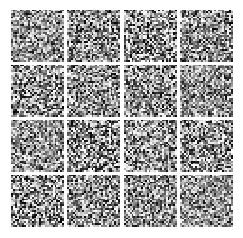
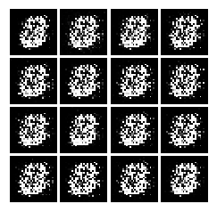
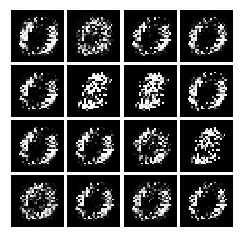
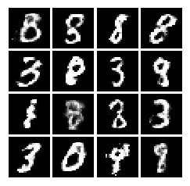
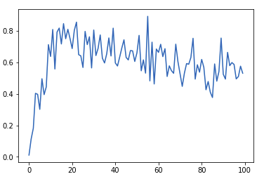
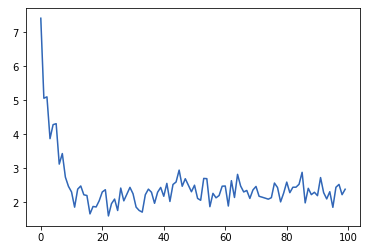

# Generative_Adversarial_Networks
Generative adversarial networks (GANs) are a class of artificial intelligence algorithms used in unsupervised machine learning, implemented by a system of two neural networks contesting with each other in a zero-sum game framework. They were introduced by Ian Goodfellow in 2014.

The branch `plain_pytorch_implementation` contains the PyTorch implementation of the same.

* [See the live action in your browser](https://cs.stanford.edu/people/karpathy/gan/)
* [Intersting Medium Read](https://medium.com/@devnag/generative-adversarial-networks-gans-in-50-lines-of-code-pytorch-e81b79659e3f)

Results : 
* **Before start of training** : 

* **After one iteration** : 

* **After two iterations** : 

* **After some hundred thousands iterations** : 

**Generator's Loss** : 

**Discriminator's Loss** : 
