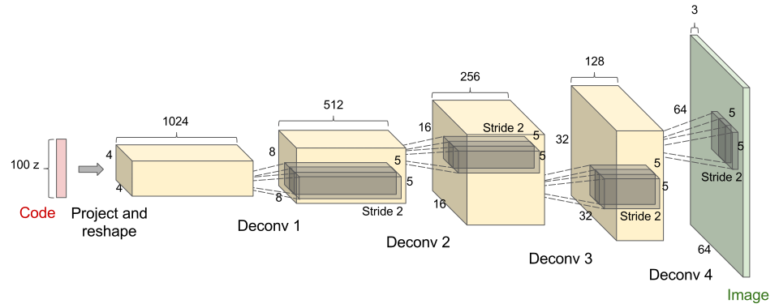

# Kharagpur Winter of Code (KWoC-2017) Project Report

## Beginning

I was notified about KWOC through a friend of mine, who shared a link to the contest page. So, opening up the page and reading though the guidelines, I was intersted to take part as I could do something productive this winter. Now, scrolling through the list of projects, it was very hard for me to decide among many interesting projects. So, I filtered projects by searching for keywords related to my fields of interest, i.e. Machine Learning and Computer Vision related projects.

## The Project(s)

So, after reading the descriptions of a few projects and checking out their repositiories. I finally decided on **Cascade-Segnet** and **Generative Adversarial Networks**. Both were interesting, related to Machine Learning and Computer Vision, and worked on a topic I had knowledge about. After e-mailing the mentors and joining the respective communications channels, I forked and cloned both repositories and started to run the existing code to see the action. But, unfortunately I was unable to run code for cascade-segnet as my graphics memory was too low. So, I had to switch over to GAN project as it had run fine, albeit a little bit slow.

## Generative Adversarial Networks using Pytorch

The GAN project was mentored by **Sangeet Kr. Mishra** and the purpose of the project is to implement GAN in pytorch and study its various implementations and applications in Digits, Face generation, Style transfer and Segmentation.

Generative Adversarial Networks are basically a class of unsupervised machine learning algorithms in which a system of two neural networks compete with each other in a zero-sum game. Introduced by Ian Goodfellow in 2014, they are used to generate images, photographs that look almost realistic to human observers. In a very basic GAN we have a single generator neural network that takes in a sample from a latent space and uses it to generate data of a particular distribution of interest. Then, we have a discriminator network which tells whether the given data is from the true distribution or generated. So, by using a known dataset of images, we train the discriminator to get better at discriminating the images, while the generator is trained to produce more and more authentic images to fool the discriminator.

## Pull Request #1

### Add Sequential model for Simple GAN PyTorch
#### To address the issue requesting a more native pytorch implementation

 

**MNIST Results @ 10K iterations vs 100K iterations:**
After 10K iterations          |  After 100K iterations
:-------------------------:|:-------------------------:
  |  

 

Started by running and understanding the existing code to generate MNIST digits. But the code was not utilizing many features provided by PyTorch such as nn.Sequential and in-built loss functions. So, taking the help of existing code along with PyTorch tutorials on nn.Sequential and documentation, I rewrote the code from the existing notebook. After everything was running fine and I was able to get same results as the previous code. I pushed the changes to my fork of the project and submitted a pull request. The request was merged after a few changes and converting the notebook to a python file.

Now, that I was confident with the project hand, I could look into more complex issues. Also, I started to modify my existing code, from a purely fully-connected implementation to a much better approach using Convolutional and Deconvolutional networks. Thus, I began my work on DCGAN (Deep Convolutional GAN).

## Pull Request #2

### Update README for DCGAN CIFAR10
#### To address the issue to replicate results for CIFAR10 dataset

 

**DCGAN - Generator Network:**

 

Although, DCGAN had been implemented in the project, I decided to code my own implementation in order to develop a better understanding. Soon, I realised that my system was not powerful enough and running even 25 epochs to get a sensible result would take far too long. So, I started looking for a suitable cloud platform to run my code and decided upon FloydHub which provided me with a free trial period for some CPU and GPU hours. Now, armed with the power of cloud compute, I ran my script and downloaded the generated images. In, just 24 epochs I had exhausted my full GPU quota, so the results were not perfect, but good nonetheless. Then I updated the README with my results and made the pull request which was merged shortly afterwards.

 

**DCGAN CIFAR10 results - Real vs Generated @ 25 epochs:**
Real Sample           |  Fake Generated
:-------------------------:|:-------------------------:
  |  

 

Now, I was even more confident that I was going somewhere in this project. At this point I decided to challenge myself and took upon the task of implementing a GAN in plain numpy.

## Attempt at Numpy-GAN
#### To address issue requesting a plain numpy implementation

Starting this, I thought, how difficult this could be. Just implement two neural networks and train them using backpropagation and SGD, simple enough. Turns out, I was wrong. I started by writing classes for Generator and Discriminator and their forward passes and weight initializations. I tested the forward pass by copying weights from PyTorch model to numpy array and it produced good results. Then, I tried to implement the backward pass and this is where my problems began. During training, the model was very unstable and the losses would either not imporove at all, or would explode, sometimes giving NaNs. The image output would always be plain noise or black indicating dead neurons. I read through many blog posts for calulating derivatives for the loss functions and layers. But, it was of no avail as the model would still collapse everytime.

I had given far too much time in this issue and the end of the coding period was fast approaching. Therefore, I halted my current work and began to work on other issues.

## Pull Request #3

### Style transfer using CycleGAN
#### To address the issue to implement style transfer using GANs

For this, I searched on google and found two suitable implementations of style transfer using GAN,
* **DiscoGAN**(https://github.com/SKTBrain/DiscoGAN) - Learning to Discover Cross-Domain Relations with Generative Adversarial Networks, and
* **CycleGAN**(https://junyanz.github.io/CycleGAN) - Unpaired Image-to-Image Translation using Cycle-Consistent Adversarial Networks

I read the related research papers and looked at the implementations in PyTorch and Tensorflow. Although, DiscoGAN looked impressive, I decided to work on CycleGAN as it was much simpler, easier to train and, given the remaining time I had, achievable in short time. 

 

**CycleGAN - Architecture:**

 

CycleGAN works by training two generators and two discriminators. Given two images X and Y, Gxy generator translates from X domain to Y (Gxy(X)->Y) while, Gyx translates from Y domain to X (Gyx(Y)->X). The trick is to add, along with adversarial loss, a cycle consistency loss to enforce Gyx(Gxy(X))->X and vice versa. Adding this additional metric to the loss function, forces the Generators to generate proper translations of image from one domain to another. Moreover, unlike in other style transfer methods, where image-to-image translation requires paired data(similar image from both domains). This approach works for unpaired data too (which is helpful as obtaining paired training data can be difficult or expensive).

 

**CycleGAN MNIST-SVHN results @ 15500 iterations:**

From SVHN to MNIST            |  From MNIST to SVHN
:-------------------------:|:-------------------------:
  |  

 

I created a new branch from before I started working on Numpy-GAN to work on this separately while the main branch with Numpy version awaits further progress. After coding and testing the scripts for errors, I ran it on a cloud instance for ~20 hrs and collected the results. After that I compiled the results into the README file and submitted a pull request which was later accepted.

## Conclusion

Although the deadline has passed, I am still working on my fork of the project improving existing code and documenting it further. I hope to finish work on numpy GAN and move on to Semantic Segmentation using GANs. 
Working for this project taught me about,
- Generative Adversarial Networks and their state of the art implementations
- PyTorch
- Git and Github
- Markdown
- Improved understanding of Neural Networks and Backpropagation
- Setting up projects on cloud 
- Hyperparameter tuning
- And much more..

It was a great learning experience and I would like to thank my mentor for being responsive and sharing useful tips regarding this project. With this new-found confidence I can now start contributing to a larger open source project.